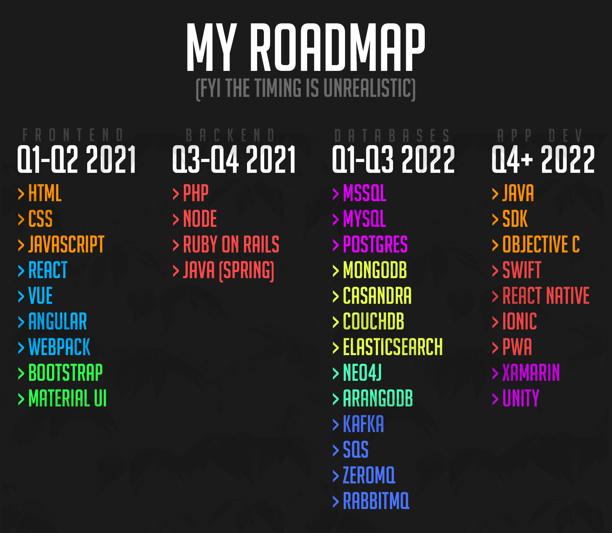

<!DOCTYPE html>
<html lang="en">
<head>
    <meta charset="UTF-8">
    <meta name="viewport" content="width=device-width, initial-scale=1.0">
    <title>I'm Gabriel - Roadmap</title>
    <link rel="stylesheet" href="./css/styleroadmap.css">
    <link rel="preconnect" href="https://fonts.gstatic.com">
    <link href="https://fonts.googleapis.com/css2?family=Rubik:wght@300;400;500&display=swap" rel="stylesheet"> 
</head>
<body>
    
    <nav class="nav">
        
        <ul class="nav-menu">
            
Roadmap

            <li>
                <a href="https://gabecoatess.github.io/social">Social</a>
            </li>
            <li>
                <a id="moreinfo" href="https://gabecoatess.github.io/moreinfo">More Information</a>
            </li>
        </ul>
    </nav>
    

        
        

            <h1>Frontend - Q1 to Q2 of 2021</h1>
            

                The front end in software engineering is what the client (or you) sees. Each color in that tab represents a different
                niche of front end development. Orange stands for the basics, blue is for frameworks, and green stands for styles.
                Starting with the <b>basics</b>. HTML stands for Hypertext Markup Language, it is the bones of a website. Without 
                HTML, the homepage would have a default font, everything would be different sizes, and the overall look of the website is unpleasant.
                But with the second basic language, CSS, we can change everything. Think of CSS as the skin, hair color, and eye color of a website.
                Now that we added good looks to the website, it begins  to look really good, though it can be made better with fancy JavaScript. 
                JavaScript can be viewed as the muscles of a website. It can be used to create functionality that HTML cant. It can also deal with
                programming logic like math and different algorithms. JavaScript is the go-to when it comes to advanced websites. Moving onto 
                frameworks. A framework in programming is basically what the name describes itself as. It is low-level code that could be
                then built upon to create specific application uses. The last, but not least niche, is styles. There isn't really a need to explain
                what styles are, but Bootstrap and Material UI are great for web applications (not really websites).
            

            <h1>Backend - Q3 to Q4 of 2021</h1>
            

                Back end development is refering to the behind the scenes of a website or web application (and others). This is the area that I don't
                understand much, so I will do some further studying on it later on. Functionality wise, it is very useful. In fact, when Facebook was
                first starting out, it would completely programmed in PHP. 
            

            <h1>Databases - Q1 to Q3 2022</h1>
            

                Databases is the longest subject to learn, which is why I dedicated 75% of next year to learning it. Databases are the areas in an
                application that store data. Whether it be user-inputted data or data that was created by the back-end from the front-end. Things
                like passwords, usernames, emails, and many more are stored. Data created automatically by the back-end are usually stuff like
                purchase date and location. Databases look a lot like an Excel file. It has rows and columns each seperated by lines. Though,
                an Excel files arent the best choice for a database, that is because security is not at all good, it can't store as much
                information that someone making a database would need, it lacks the amount of features a dedicated database service has, and most
                importantly, an Excel file can actually corrupt if its being written and read multiple times very quickly by many different users.
            

            <h1>App Development - Q4+ 2022</h1>
            

                App Development is by far my personal favorite, though I know nothing about app development except for Unity. Since this is the last
                thing I have to learn to become a full stack developer, I gave it any amount of time that I need. Though, finishing it sooner is the
                most desirable. I have also saved this for last because app development requires a bit of knowledge of all the previous categories,
                you need to know how to manage large projects, master syntax memory and debugging, and for things like testing/publishing iOS apps,
                I would need an Apple product cabable of programming in their dedicated Swift language and an Apple developer account. Both of which
                costs a significant amount of money. Which is why you can support me on my <a href="https://gabecoatess.github.io/socials">socials</a> page!
            

        

    

</body>
</html>